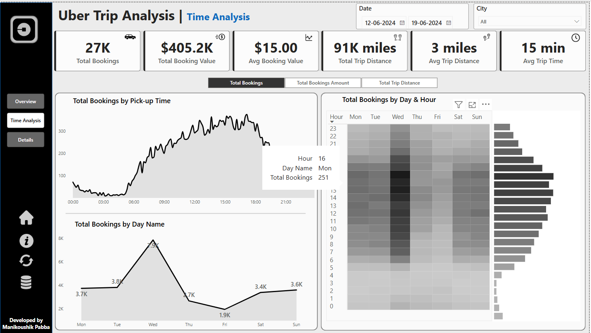

# Uber-trip-Analysis
This project presents a comprehensive analysis of Uber trip data using Power BI. It explores booking patterns, trip metrics, and location insights to uncover trends in rider behavior and operational performance.

This repository contains a Power BI dashboard project that analyzes Uber trip data to uncover insights related to booking trends, trip behavior, and location-based performance.

---

## 📊 Project Overview

The Uber Trip Analysis project explores a variety of KPIs and visualizations to help understand:
- Booking volumes and total revenue
- Average booking value, trip distance, and trip time
- Day vs night trip distribution
- Peak booking hours and most active weekdays
- Most common pickup and drop-off points
- Preferred vehicle types and their performance

---

## 🧰 Tools & Technologies Used

- **Power BI**: Data modeling, DAX calculations, and dashboard development
- **Microsoft Excel**: Data preprocessing and cleaning
- **GitHub**: Version control and sharing

---

## 📌 Objective

To create an interactive Power BI dashboard that enables stakeholders to:
- Make informed decisions based on travel trends
- Understand customer behavior and optimize ride availability
- Identify opportunities for growth in different city zones

---

## 📷 Screenshots

| Overview Tab | Time Analysis Tab | Details Tab |
|--------------|-------------------|-------------|
|  |  |  |

---

## 📎 License

This project is open-source and free to use for educational or portfolio purposes.

---

## 🙌 Acknowledgments

Dashboard developed by **[Your Name]**  
Inspired by sample data and Power BI tutorials for portfolio development.

---

